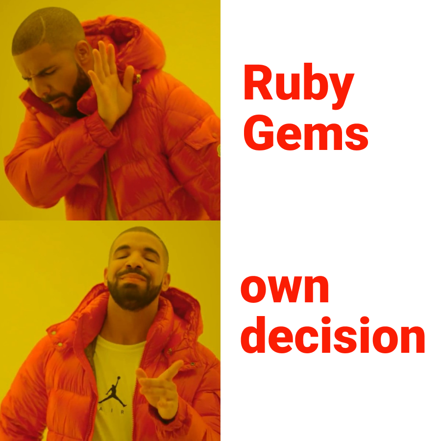

# If there is no usermodel yet, user logic #

```ruby
#Gemfile
gem "devise"
```
```ruby
$ rails generate devise:install
```

```ruby
$ rails generate devise User
```

```ruby
$ rails g migration AddNameToUsers name:string

$ rake db:migrate
```


```ruby
#app/controllers/application_controller.rb

class ApplicationController < ActionController::Base
  before_action :configure_permitted_parameters, if: :devise_controller?

  protected

  def configure_permitted_parameters
    added_attrs = %i[name]
    devise_parameter_sanitizer.permit(:sign_up, keys: added_attrs)
  end

end
```


```ruby
$ rails generate controller Users
```

# The meaning of the repository, replacing the gem #

```ruby
#app/controllers/users_controller.rb

class UsersController < ApplicationController
  before_action :set_user, only: :show

  def show
    # @letters = @user.name.upcase[0..1]
    @letters = @user.name.split.map(&:chr).join.upcase[0..1]
  end

  private

  def set_user
    @user = User.find_by name: params[:name]
  end

end
```

```html
#app/views/users/show.html.erb

<div style="text-align: center;">

  <svg width="100" height="100" viewBox="0 0 100 100" fill="none" xmlns="http://www.w3.org/2000/svg">
<circle cx="50" cy="50" r="50" fill="#9090FF"/>
<text fill="#fff" font-family="Helvetica,Arial,sans-serif" font-size="36" font-weight="500" x="50%" y="55%" dominant-baseline="middle" text-anchor="middle">
<%= @letters %>
  </text>
</svg>

  <%= @user.name %>

</div>
```


